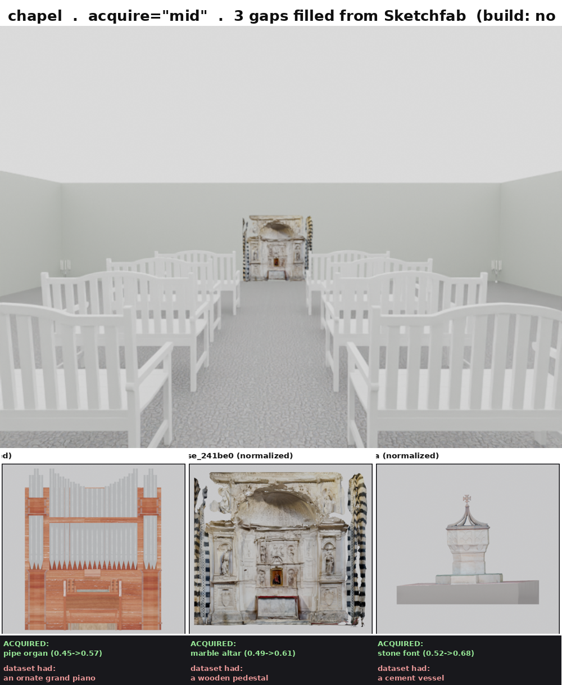
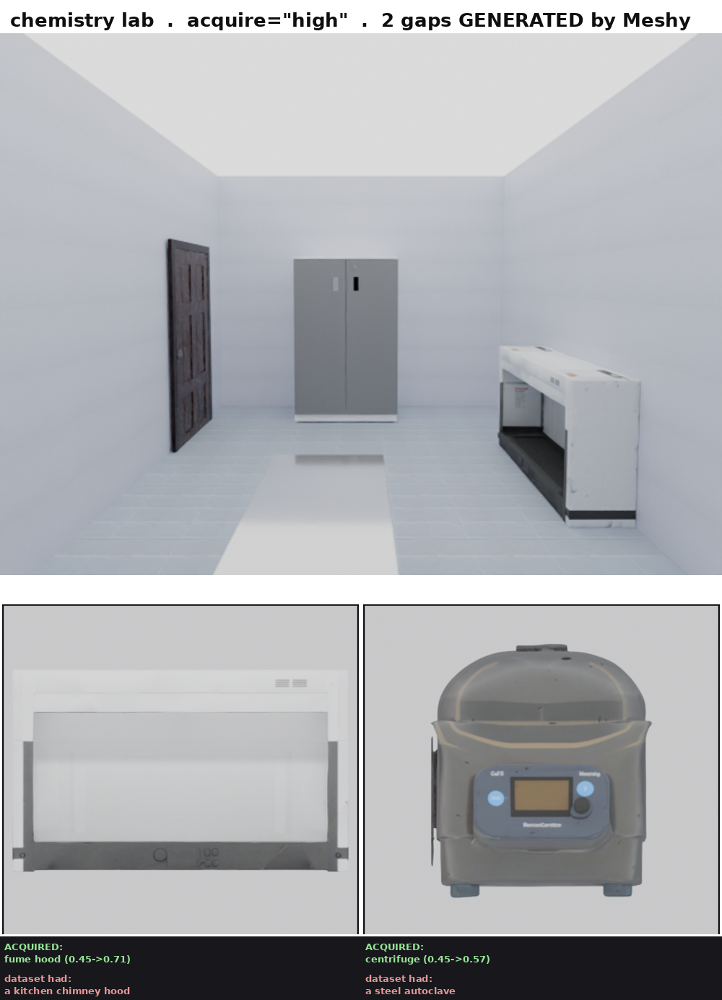

# Scene review board — 2026-07-14-acquire

One section per scene: the brief it was built to, the build verdict, the 4-view strip,
and a **Feedback** block that is YOURS — write anything under it (looks wrong / wrong
vibe / wrong furniture / approve). A later session collects every non-empty block,
acts on it, and folds the durable findings into `skills/examples/`.

## 1. Chapel — acquire="mid" (Sketchfab)  <!-- scene:chapel_mid -->

- **Category:** acquisition-dial test
- **Program:** `scenes/work/chapel_acquire_mid.py`
- **Build verdict:** built clean (no rotation / no wall overlap); 3 of 3 gaps filled from Sketchfab
- **Notes:** Acquisitions: pipe organ (0.45->0.57), marble altar shrine (0.49->0.61), stone baptismal font (0.52->0.68). The wall-centre VLM cameras clip the deep 2m altar (acquired assets arrive at true scale) — the axial hero view is clean; that is the bakery/closet camera rule, not a dial fault.
- **Brief:** A chapel where 3 of the 5 asset queries are genuine dataset gaps. At acquire="low" the organ silently becomes a grand piano, the altar a wooden pedestal, the font a cement vessel. At "mid" the retriever measured each gap and pulled the real object from Sketchfab, normalized + front-verified it, and kept it only because it actually closed the gap. The two HAVE assets (pews, candle stands) resolved from the dataset untouched.

#### Feedback (Kunal — write anything below this line)

_(no feedback yet)_

## 2. Chemistry lab — acquire="high" (Meshy generation)  <!-- scene:lab_high -->

- **Category:** acquisition-dial test
- **Program:** `scenes/work/lab_acquire_high.py`
- **Build verdict:** built (no wall overlap); all 3 gaps filled — 2 GENERATED by Meshy, 1 from Sketchfab
- **Notes:** Fume hood: Sketchfab exhausted -> Meshy generated (0.45->0.71). Centrifuge: Meshy generated (0.45->0.57). Microscope: Sketchfab 'microscope' (0.50->0.56). An earlier high run hit a 2h timeout mid-ladder (3 full-ladder gaps is slow) but banked the Meshy assets; this rebuild finished from cache. Room render is phase-1 (floor mass) and overexposed (white lab); the per-asset strips are the real evidence.
- **Brief:** A chemistry lab: an interior full of equipment a furniture dataset has no reason to contain, and that Sketchfab's free tier does not carry either. At acquire="low" the fume hood is silently a kitchen chimney hood. At "high" the retriever measured each gap, exhausted Sketchfab, and GENERATED the missing equipment with Meshy — normalizing, front-verifying and gap-checking each before keeping it.

#### Feedback (Kunal — write anything below this line)

_(no feedback yet)_
