# Scene review board — 2026-07-14

One section per scene: the brief it was built to, the build verdict, the 4-view strip,
and a **Feedback** block that is YOURS — write anything under it (looks wrong / wrong
vibe / wrong furniture / approve). A later session collects every non-empty block,
acts on it, and folds the durable findings into `skills/examples/`.

## 1. Hotel-style bathroom  <!-- scene:ba_hotel_double -->

- **Category:** bathroom
- **Program:** `scenes/batch_0714/ba_hotel_double.py`
- **Build verdict:** CONVERGED: no rotation / no wall overlap, no lints; rescale 0.86 held (enclosed-bath brief).
- **Brief:** Double vanity, walk-in glass shower in a wall END slot, toilet set, teak bench with plush towels + candles, towel ladder, grey marble + warm wood.

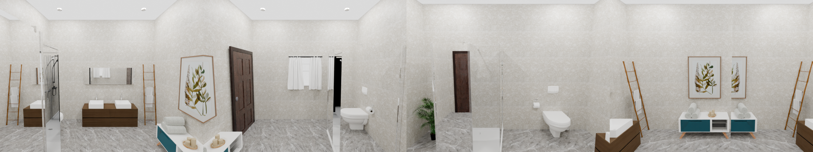

#### Feedback (Kunal — write anything below this line)

_(no feedback yet)_

## 2. Compact powder room  <!-- scene:ba_powder_compact -->

- **Category:** bathroom
- **Program:** `scenes/batch_0714/ba_powder_compact.py`
- **Build verdict:** CONVERGED after swapping the floating vanity mesh (hssd/6b408a09); deliberately tight jewel-box shell; rescale 0.9 held.
- **Brief:** Four-object jewel box at 0.6 scale: single vanity SET (own mirror), toilet SET, towel ladder, plant; deep-teal walls, no window.

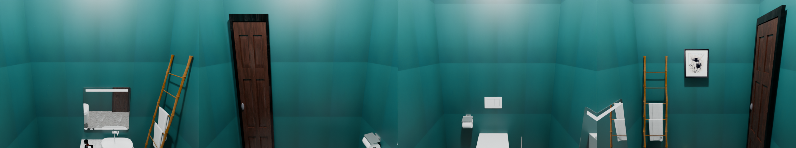

#### Feedback (Kunal — write anything below this line)

_(no feedback yet)_

## 3. Spa master bathroom (flagship)  <!-- scene:bathroom_spa -->

- **Category:** bathroom
- **Program:** `skills/examples/bathroom_v1.py`
- **Build verdict:** converged; deliberate 0.72 tightness documented (bathroom.md)
- **Brief:** Spa bath: freestanding tub under window, walk-in shower, warm-wood double vanity, brass.

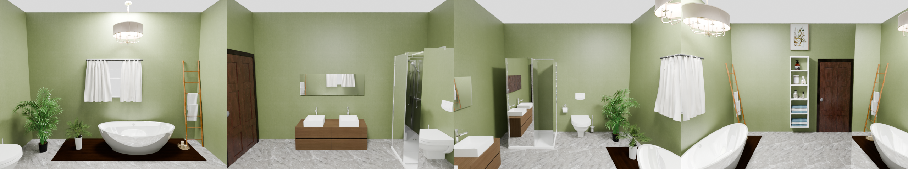

#### Feedback (Kunal — write anything below this line)

_(no feedback yet)_

## 4. Bedroom (flagship)  <!-- scene:bedroom -->

- **Category:** bedroom
- **Program:** `skills/examples/bedroom_v1.py`
- **Build verdict:** converged clean; phase-1 verified in the 2026-07-13 round (bedroom.md)
- **Brief:** Master bedroom: bed + nightstands, wardrobe, dresser, soft palette.

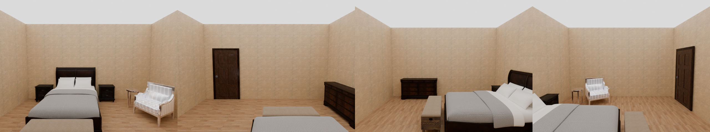

#### Feedback (Kunal — write anything below this line)

_(no feedback yet)_

## 5. Cozy guest bedroom  <!-- scene:br_guest_cozy -->

- **Category:** bedroom
- **Program:** `scenes/batch_0714/br_guest_cozy.py`
- **Build verdict:** CONVERGED: no rotation / no wall overlap. Wall-occlusion warning = the benign art-above-the-headboard class (fully visible in the render). Grow vote 1.1 held.
- **Brief:** Double bed with layered bedding + foot bench, symmetric nightstand/lamp pairs, styled dresser, armchair + floor-lamp reading vignette, landscape art over the headboard, greige/oak.

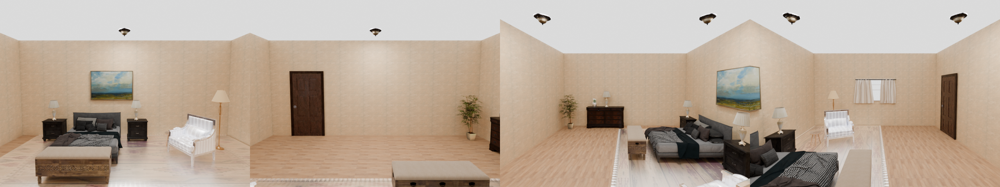

#### Feedback (Kunal — write anything below this line)

_(no feedback yet)_

## 6. Teen bedroom with study corner  <!-- scene:br_teen_study -->

- **Category:** bedroom
- **Program:** `scenes/batch_0714/br_teen_study.py`
- **Build verdict:** CONVERGED, fully clean (no rescale / no rotation / no wall overlap). Build 2 shrank the oversized flush-mount disc (modulate_scale 0.4).
- **Brief:** Single bed + nightstand, WorkstationGroup study desk (screen faces the chair), stocked corner bookshelf, green beanbag, posters, denim-blue/maple palette.

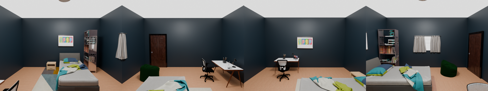

#### Feedback (Kunal — write anything below this line)

_(no feedback yet)_

## 7. Dining room (flagship)  <!-- scene:dining_room -->

- **Category:** dining room
- **Program:** `scenes/dining_room.py`
- **Build verdict:** converged clean (see skills/examples/dining_room.md)
- **Brief:** Classic dining room: rectangular table + chairs, sideboard, pendant, art.

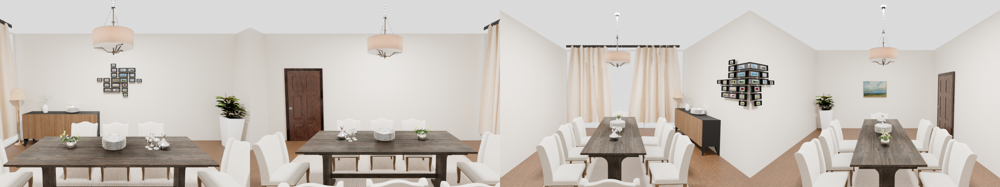

#### Feedback (Kunal — write anything below this line)

_(no feedback yet)_

## 8. Sunny breakfast nook  <!-- scene:dr_breakfast_nook -->

- **Category:** dining room
- **Program:** `scenes/batch_0714/dr_breakfast_nook.py`
- **Build verdict:** CONVERGED: no rotation / no wall overlap; rescale 1.03 = neutral.
- **Brief:** Round oak tripod table + 4 woven-seat chairs, white sideboard with fruit/vase/pothos vignette, jute rug, rattan dome pendant, sheer-curtained window.

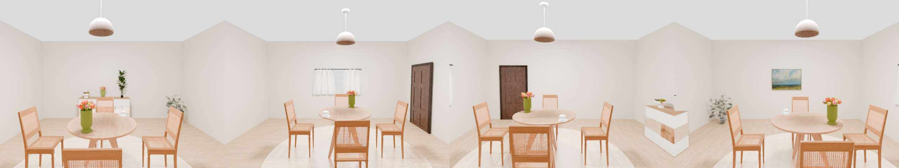

#### Feedback (Kunal — write anything below this line)

_(no feedback yet)_

## 9. Farmhouse dining room  <!-- scene:dr_farmhouse -->

- **Category:** dining room
- **Program:** `scenes/batch_0714/dr_farmhouse.py`
- **Build verdict:** CONVERGED: no rotation / no wall overlap; rescale 0.96 = neutral.
- **Brief:** 2.4 m rustic plank table with cross-back chairs one side + a bench on the other, host chairs at the ends, low rustic sideboard, iron cage-lantern pendant, cream curtains.

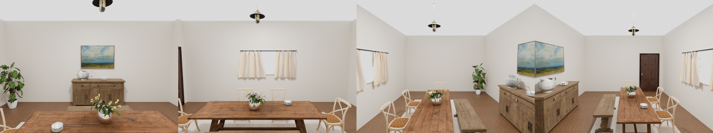

#### Feedback (Kunal — write anything below this line)

_(no feedback yet)_

## 10. L-kitchen with pocket island (NEW today)  <!-- scene:kitchen_l_pocket -->

- **Category:** kitchen
- **Program:** `skills/examples/kitchen_l_v1.py`
- **Build verdict:** converged clean 2026-07-14 (build 5; camera bound documented)
- **Brief:** Warm-grey L set, island floating in the concave middle (KitchenIslandGroup pocket mode), 2 stools, corner fridge, dining nook.

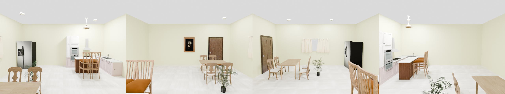

#### Feedback (Kunal — write anything below this line)

_(no feedback yet)_

## 11. Modular-run kitchen (recipe B)  <!-- scene:kitchen_modular -->

- **Category:** kitchen
- **Program:** `skills/examples/kitchen_v1.py`
- **Build verdict:** converged clean (kitchen.md recipe B)
- **Brief:** Warm marble kitchen assembled from modules: cook run + hood row, island + stools, dining.

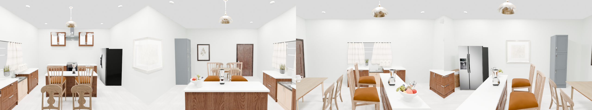

#### Feedback (Kunal — write anything below this line)

_(no feedback yet)_

## 12. U-kitchen with attached peninsula (NEW today)  <!-- scene:kitchen_u_peninsula -->

- **Category:** kitchen
- **Program:** `skills/examples/kitchen_set_v3.py`
- **Build verdict:** converged clean 2026-07-14 (no rotation / no wall overlap, no lints)
- **Brief:** Navy U fitted set, island attached at the longer wing's frontal tip across the mouth (KitchenIslandGroup tip mode), 1 stool, dining beyond.

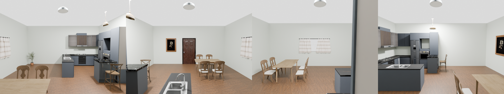

#### Feedback (Kunal — write anything below this line)

_(no feedback yet)_

## 13. Straight-set galley kitchen (front island)  <!-- scene:kt_galley_straight -->

- **Category:** kitchen
- **Program:** `scenes/batch_0714/kt_galley_straight.py`
- **Build verdict:** CONVERGED: no rotation / no wall overlap, no lints; rescale 0.88 held per the interior-camera bound. KitchenIslandGroup 'front' mode verified in production (island parallel to the run, stools seated).
- **Brief:** Straight 8/11 fitted set (fridge included) at 2.2 m, bare-top island + riding pendant parallel in front (KitchenIslandGroup front mode), 2 stools, 2-top dining, corner-pinned.

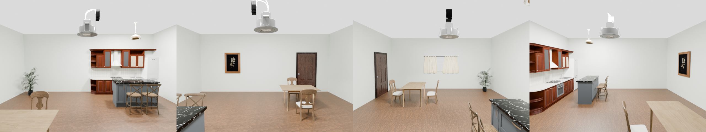

#### Feedback (Kunal — write anything below this line)

_(no feedback yet)_

## 14. Cozy living room (flagship)  <!-- scene:living_room_cozy -->

- **Category:** living room
- **Program:** `scenes/work/living_room_cozy.py`
- **Build verdict:** converged clean (see skills/examples/living_room_cozy.md)
- **Brief:** Warm cozy living room: sofa cluster + coffee table, TV wall, layered lamps, rug.

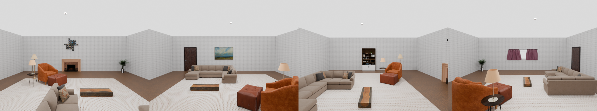

#### Feedback (Kunal — write anything below this line)

_(no feedback yet)_

## 15. Japandi minimalist living room  <!-- scene:lr_japandi -->

- **Category:** living room
- **Program:** `scenes/batch_0714/lr_japandi.py`
- **Build verdict:** CONVERGED: no rotation / no wall overlap, no lints; mild rescale 0.92 held (sparse is the brief).
- **Brief:** Sparse Japandi lounge: low wood-frame sofa facing a low TV console across a bare oak table, jute pouf, paper tripod lamp, fig, one ink artwork, paper-lantern pendant.

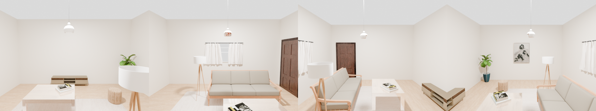

#### Feedback (Kunal — write anything below this line)

_(no feedback yet)_

## 16. Mid-century entertaining lounge  <!-- scene:lr_midcentury -->

- **Category:** living room
- **Program:** `scenes/batch_0714/lr_midcentury.py`
- **Build verdict:** CONVERGED: no rotation / no wall overlap, no lints; rescale 0.95 ~ neutral.
- **Brief:** Tufted leather sofa + two mustard armchairs ringed around a round walnut table, credenza with record player + gallery wall, stocked bar cart, brass floor lamp, teal accent.

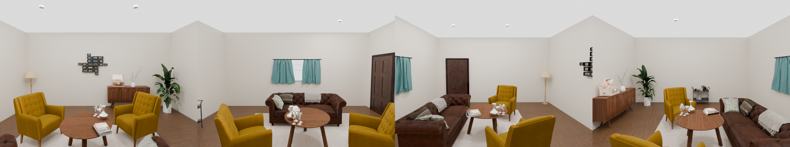

#### Feedback (Kunal — write anything below this line)

_(no feedback yet)_

## 17. Home office / study  <!-- scene:st_home_office -->

- **Category:** study room
- **Program:** `scenes/batch_0714/st_home_office.py`
- **Build verdict:** CONVERGED: no rotation / no wall overlap; rescale 0.8 vote RECORDED and held — flag in feedback if the room reads too airy.
- **Brief:** Centre WorkstationGroup facing the front window (power layout), tall stocked bookcase off-centre, leather armchair + brass floor lamp reading corner, rug under the desk zone.

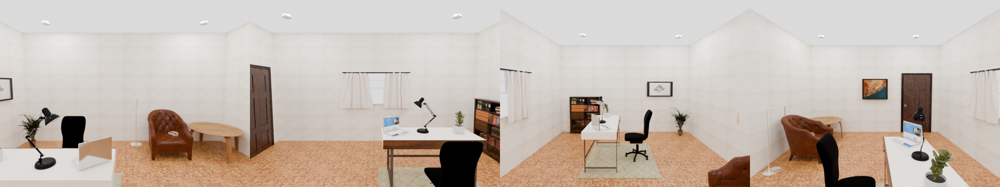

#### Feedback (Kunal — write anything below this line)

_(no feedback yet)_

## 18. Library-style study  <!-- scene:st_library_study -->

- **Category:** study room
- **Program:** `scenes/batch_0714/st_library_study.py`
- **Build verdict:** CONVERGED: no rotation / no wall overlap; rescale 0.8 vote recorded — the room reads sparse for 'library'; good candidate for feedback (more shelves? tighter shell?).
- **Brief:** Three tall stocked walnut bookcases in back-wall slots (centre clear), central reading table with 2 chairs + banker's lamp + globe, armchair corner, deep-green walls over dark oak.

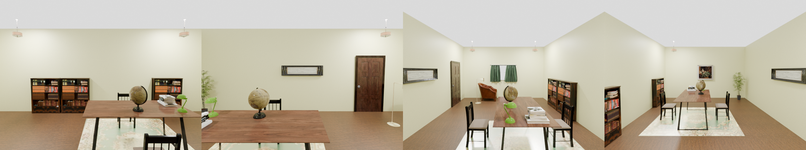

#### Feedback (Kunal — write anything below this line)

_(no feedback yet)_

## 19. Writer's studio  <!-- scene:st_writer_studio -->

- **Category:** study room
- **Program:** `scenes/batch_0714/st_writer_studio.py`
- **Build verdict:** CONVERGED. Build 1 fully clean; build 2 (fixture shrink only) flip-flopped a 'rotate daybed to face desk' vote + rescale 0.9 — identical program, opposite verdicts = VLM noise class; declined on the render (wall daybed correctly faces the room). Ceiling-disc fixture fixed at 0.4.
- **Brief:** Flat-desk WorkstationGroup near the window, beige daybed, low stocked bookshelf, plants, framed prints, sheer curtains; laptop + rotary phone carry the vintage cue (no typewriter mesh exists).

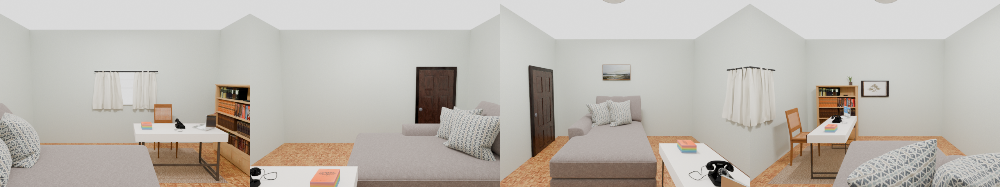

#### Feedback (Kunal — write anything below this line)

_(no feedback yet)_
