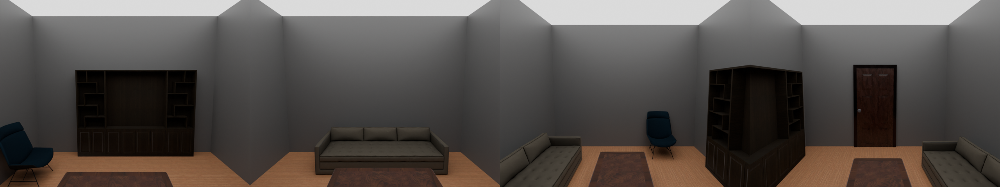

# Skill: acquire assets the library doesn't have

## The dial: `acquire="low" | "mid" | "high"`

The shop above is the side door — you have to already KNOW an asset is missing. The dial is the
front door: the retriever itself escalates when the dataset cannot serve a query.

```python
scene = SceneProgRoom("Chapel", seed=3, acquire="mid")     # or IDSDL_ACQUIRE=mid
```

| level | what it may do | when |
|---|---|---|
| `low` (default) | nothing — take the dataset's best hit, however wrong | always the right default |
| `mid` | SEARCH Sketchfab to fill a measured gap | free, slow (minutes per gap) |
| `high` | ...and GENERATE with Meshy if the web has nothing | spends credits |

**The dataset always gets first refusal**, at every level. The dial only ever engages on a
*measured* gap — top-1 similarity below `0.55` — and that number is not a guess. Measured on the
real index:

```
0.81  "a modern grey three seat sofa"  -> a modern grey three-seat sofa   SERVED
0.64  "a pinball machine"              -> a pinball machine               SERVED
0.50  "a vintage red gas pump"         -> a beige pedal car               GAP
0.46  "a wooden church lectern"        -> a wooden weaving loom           GAP
0.45  "a chemistry fume hood"          -> a kitchen chimney hood          GAP
0.43  "a hospital defibrillator"       -> a wheelchair                    GAP
```

Below ~0.55 the top hit stops being the thing you asked for and starts being something that merely
embeds near it — and **nothing downstream ever says so**. The scene just quietly contains a
wheelchair. That silence is the whole reason the dial exists.

Acquisition is a fallback, never a strategy: an asset already in the library is faster, free,
reproducible and known-good. Guards, all of them load-bearing:

- **An acquisition must CLOSE THE GAP IT WAS MADE FOR, or it is rolled back.** Getting *an* asset
  is not getting the RIGHT one. Asked to generate a fume hood, Meshy returned a white box the
  captioner filed as a *"recessed fireplace insert"* — left alone, the scene silently gets a
  fireplace AND the library permanently gains an asset indexed under the wrong words. So we
  re-measure the same gap afterwards; if it is still open, the asset comes back out
  (`IDSDL.shop remove`) and we fall back to the dataset. The .glb stays in the batch dir with its
  HELP.md entry, so a human can still rescue it.
- **Budget** (`IDSDL_ACQUIRE_BUDGET`, default 6 per process) — a runaway loop here costs real
  money and hours of Blender.
- **One attempt per query.** A gap that could not be filled is not re-attempted.
- **Never fatal.** A failed acquisition falls through to the dataset's best hit — i.e. exactly the
  old behaviour. The scene still builds.

Three things had to be fixed before any of this worked, and they are all worth knowing:

1. **Scene-speak is not search-speak.** Our queries are written for an embedding index and read
   like prose; Sketchfab's search is literal keywords. `"a chemistry fume hood"` returns **0**
   hits; `"fume hood"` returns 3. So the acquirer rewrites the query into 3 search terms,
   narrow→broad, and tries each. (Meshy gets the ORIGINAL prose — generation wants description,
   search wants keywords. Easy to get backwards.)
2. **The size prior was circular.** It prices an asset against its nearest library neighbours —
   but an asset worth acquiring is *by definition* one the library has no neighbours for. It
   blocked precisely the acquisitions that mattered. Relaxed for gap-fills, and only for size: a
   wrong size is visible in the render and any program can override it (`width=`); a wrong front
   is silent. Both front judges stay strict.
3. **An asset is only as findable as the words it is indexed under.** A perfect Gothic
   confessional booth came back captioned without the word "confessional" anywhere in it — so it
   embedded at 0.41 against "a church confessional booth" and was, correctly by the numbers and
   absurdly in fact, judged not to be one. Ingest now also indexes `aliases`: what the triage VLM
   called the object, and the query that went looking for it. Both were known and being thrown
   away.

`acquire.report()` lists what a build acquired. Silence there means the dataset carried the whole
scene, which is the outcome we actually want.


The library used to be a closed set: 29k dataset assets, plus whatever `.glb`s a human had
already downloaded, hand-oriented and hand-scaled. `IDSDL/shop` makes it open — a query goes in,
a normalized, verified, retrievable asset comes out — and the human is only consulted about the
things a machine genuinely should not decide alone.

```bash
python -m IDSDL.shop search "reception desk"            # look, ingest nothing
python -m IDSDL.shop run "reception desk" --count 6     # the whole pipeline
python -m IDSDL.shop run "..." --manual                 # ...and ask me about the hard ones
python -m IDSDL.shop apply shops/<batch>                # act on my answers in HELP.md
python -m IDSDL.shop remove custom/<sha>                # un-ingest a mistake
```
From an agent, the same thing is `shop_search` / `shop_run` / `shop_apply` over MCP; `shop_run`
re-warms the retrievers, so an asset ingested mid-session is retrievable in that same session.

## The contract you are meeting

`IDSDL.ingest` assumes — and never checks — that a `.glb` is **one mesh, real-world metres,
Y up, front facing +Z**. Internet models satisfy none of that. The shop's whole job is to make
them satisfy it, which reduces to three judgments a human used to make by eye:

1. **which way is the FRONT** (the library's front is glTF `+Z`, which is Blender `-Y`),
2. **how BIG is it really**,
3. **is this even ONE object** (or a scene, a set, a pack).

Everything else is mechanical.

## The one idea that makes it work: never let the model do axis arithmetic

The preview is a strip of four straight-on renders, **numbered and captioned**:

```
PANEL 1 (+Y side)   PANEL 2 (-Y side)   PANEL 3 (+X side)   PANEL 4 (-X side)
```

The VLM answers *"which PANEL shows the front?"* — a question about a picture. Python then does
the axis arithmetic, which is the part that always went wrong when a human did it by eye:

| front is on | rotate about Z |
|---|---|
| panel 2 (-Y) | 0 |
| panel 1 (+Y) | 180 |
| panel 3 (+X) | -90 |
| panel 4 (-X) | +90 |

Then — this is not optional — the pipeline **re-renders the file it actually wrote** and asks a
second VLM whether the front really did land on panel 2. A wrong front is invisible downstream
(the placement code dutifully turns the asset's *back* to face the room), so it must be caught
here or never. If the check fails, rotate by the residual and retry ONCE, then stop guessing and
ask the user.

Know what that verify pass does and does not buy you: it catches **rotation-math** errors, not
**judgment** errors. If the model thinks a shelf's back is its front, it will think so just as
firmly on the re-render. Which is why the front is judged twice, differently.

## Agreement, not confidence

Every gate in `triage.py` is a *disagreement* detector, because a single confident answer is
exactly what put a wall shelf into the library back-to-front during development.

- **Front: two lenses.** One VLM is asked which side is the front; a second is asked, in
  completely different words, *"if you walked up to use this, which side would you stand at?"*
  They must agree. On the ground-truth set, this is what caught the shelf (judge said the flat
  back, the second opinion said the shelved side — the second one was right).
- **Size: vision vs. the library.** The VLM is the worst estimator we have of real-world size —
  it is guessing metres from an object on a grey background with no reference. But the library
  holds ~29k curated real widths and we own the embedder that indexes them, so we look the object
  up among its nearest neighbours and take their median width. Measured against ground truth:

  | | lounge chair (0.5 m) | 3-seat sofa (2.5 m) | coffee table (1.2 m) |
  |---|---|---|---|
  | VLM vision | 0.62 (+25%) | 3.11 (+24%) | 2.41 (**+100%**) |
  | library neighbours | 0.60 (+20%) | 2.35 (-6%) | 1.35 (+13%) |

  So **the prior sets the size and vision is the cross-check.** When the two disagree beyond
  `[0.55, 1.8]x`, that usually means the object was *misidentified*, not mis-measured — our shelf
  came back as a "wooden panel", and the library's wooden panels are 0.6 m, not 2.7 m — and a
  misidentified object is precisely what a human should look at. (Tunable:
  `triage.PRIOR_MIN_SIM`, `PRIOR_LO/HI`.)

## Skip vs ask — the distinction the whole design rests on

`auto` mode "skips the hard ones" and `manual` mode "asks for help", so the two buckets must
mean genuinely different things:

- **skip** = mechanically unusable, never worth a human's minute: several separable units in one
  file (the human used to split these by hand — we do not guess), not an interior object,
  degenerate geometry, animated/rigged, no glTF offered.
- **ask** = a judgment we decline to make alone: the two front judges disagreed, the size fights
  the library, confidence is low, the self-verify failed twice.

Filing an *uncertain* asset as a *skip* silently throws away a good model — that is the failure
this split exists to prevent. Nothing is ever dropped quietly either: skips are listed on the
board too, so you can overrule them.

## HELP.md — how the pipeline asks

Same idiom as the scene review board (`tools/review_board.py`): one section per asset, the
labelled strip, the hero view, why it needs you, and a block you edit in place. Regenerating
never destroys an answer.

```
#### Your call — edit the block below
action: accept
front:  4   # it's a wall bookshelf — the openings are on panel 4, not the flat back
size:   2.5
anchor: width
```
`python -m IDSDL.shop apply shops/<batch>` reads those, normalizes with YOUR numbers (a
user-set front overrules the verifier — you looked at the render, it only guessed), ingests, and
regenerates the board.

**A missing Sketchfab token is a supported state, not an error.** Search is public; downloading
needs a free token (`SKETCHFAB_API_TOKEN` in `.env` — Kunal's is set). Without one, every
candidate becomes a `needs_download` entry on the board with its link, and anything the user drops
into `<batch>/inbox/` is picked up by `apply` — name the file `<key>.glb` and it inherits that
candidate's licence and attribution.

## Licences are not optional

Every ingested asset carries `provenance` (source, uid, url, licence, author) into its library
metadata, and the run prints an attribution block. Default search filter is `permissive`
(CC0 + CC-BY); `commercial-ok` excludes NonCommercial. An asset whose origin we cannot name is
an asset we cannot ship.

## The Blender fixes in `bl_job.py` are load-bearing

Six of them, each one bought with real debugging time. Read the docstring before you "simplify"
any of them. Five came from the hand-rolled normalizer that preceded this
(`glb-shop-normalizer`); the sixth is ours:

1. **Unit-scale overwritten by resize** — join, then unparent by *assigning* `matrix_world`
   (the operator no-ops in `--background`), delete the empties, `transform_apply`. Otherwise a
   later `obj.scale = f` *replaces* the importer's cm->m scale instead of composing → 72x blowups.
2. **Quaternion rotation mode** — the importer leaves objects in `QUATERNION`, where assigning
   `rotation_euler` is silently ignored. Force `rotation_mode = 'XYZ'` first.
3. **The EEVEE enum name moves between Blender versions** — pick whichever the running build
   offers (`BLENDER_EEVEE_NEXT` on 4.5, `BLENDER_EEVEE` on 5.x).
4. **Camera clip planes cull large-unit models** — a model authored in millimetres is thousands
   of units tall and falls past the default far clip; it renders as a blank grey frame and the
   VLM calls it empty.
5. **UV-safe join** — Blender's Join merges UV layers *by name* off the ACTIVE object; if the
   active mesh has no UVs, textured UVs scramble and the textures vanish. Give every mesh a
   `UVMap` active-render layer and anchor the join to a mesh that has UVs.
6. **Lighting must not pick a favourite side** *(new)* — a single fixed sun lights +X and leaves
   -X black, and the VLM then reliably calls the *bright* side the front. A wall shelf whose flat
   back was lit and whose shelved front was in shadow got its front called 180 degrees wrong,
   with 0.78 confidence. **The render was lying, not the model.** So the key light now rides the
   camera: each panel gets an identical headlight, plus a strong even ambient. If you ever find
   yourself blaming the VLM for a front call, look at the render first.

## Generating what nobody has: `--source meshy`

`IDSDL/shop/meshy.py` is the same pipeline with the search step replaced by a generator — a
generated model arrives just as un-normalized as a download (no canonical front, no real scale),
so it needs exactly the same triage and gets it for free. Needs `MESHY_API_KEY` in `.env`. Every
generation spends credits (~5 preview, ~10 refine), so `count` is never inferred; check the
balance first with `MeshySource().balance()`.

```bash
python -m IDSDL.shop run "a cork pinboard in a wooden frame with notes pinned to it" \
    --source meshy --count 1
```

**A texture is not a finishing touch — it is what makes the asset legible.** Meshy's `preview`
mode returns geometry with NO texture: a uniform grey blob. It is not a cheaper version of the
asset, it is half of one, and ingested as-is it poisons the library twice:

| | preview (untextured) | refine (textured) |
|---|---|---|
| what the caption VLM indexed it as | *"Large gray metal wall panel"* | *"Square orange felt bulletin board with a natural wood frame and assorted pinned notes"* |
| front call | **wrong** (picked the blank back) | correct (panel 2, the notes side) |
| needed a human | yes | no — clean auto-ingest |

Both failures have the same cause: the features that mark a front — pinned notes, labels, screens,
branding — are TEXTURE, not geometry. Strip the texture and the front judgment has nothing to see,
and the captioner indexes the silhouette. So **refine is the default** and `--no-refine` is the
opt-out for when you only want to look at a shape.

Belt and braces: any asset that normalizes to **zero textures** is never ingested silently — it
goes to the board as `untextured`, whatever the source. It renders as a flat grey solid, and that
is a failure that hides itself.

## How we know it works

Ground truth was manufactured: four known dataset assets (a lounge chair, a 3-seat sofa, a coffee
table, a wall bookshelf) were **deliberately mangled** — each rotated by a known angle about Z and
its units blown up 100x, exactly like a real download — and the pipeline was told none of it.

- **Fronts:** 3 of 4 recovered automatically and exactly. The 4th (the wall shelf) was the
  interesting one: it was *never ingested wrong*, because on one run the two front judges
  disagreed and on another the size cross-check fired. It went to the board, one line settled it,
  and `apply` rotated it +90 to land the openings back on panel 2.
- **Sizes:** +13%, +20%, -6% of true (the VLM alone was +100%, +25%, +24%).
- **In a real room** (`proof_scene.py` -> `proof_render.png`): all four sit correctly oriented and
  correctly proportioned, and the build's own VLM pass returned "no rotation / no wall overlap".



On raw internet input (six un-normalized Sketchfab downloads from `hospital.zip`) the multi-unit
gate correctly **skipped** a file containing three separate draped instrument tables, and most of
the rest went to the board — the library has no size prior for a slit lamp and the VLM knows it is
guessing. **Expect a high auto-yield on ordinary furniture and a low one on exotic equipment.**
That is the pipeline being honest, not broken.

### Live, against both real APIs (2026-07-14)

Both legs were then run for real, aimed at two gaps this codebase had already *documented* as
unfillable — `examples/`'s writer's-studio notes record that the dataset has **no typewriter**
(best retrieval 0.52, all rotary phones) and **no cork pinboard** (0.47, all classroom
whiteboards). Both now exist:

- `run "vintage typewriter" --count 5` (Sketchfab): 5 downloaded, 1 auto-ingested — a textured
  Royal typewriter, 0.45 m, `placement=NA` (correctly a tabletop object), front on panel 2, CC-BY
  attribution printed. The other 4 went to the board, one of them because it was not a typewriter
  at all but a *fragment* of one ("metal piece of a typewriter").
- `run "a cork pinboard ..." --source meshy --count 1`: generated, refined, normalized, verified
  and auto-ingested with no human in the loop.

The pipeline holds up on live input. Its judgment is only as good as what the render shows it —
which is the whole reason the lighting fix and the refine default exist.

## Checklist for a batch

- [ ] `search` first — if the internet has nothing good, no pipeline will save you.
- [ ] Run `--dry-run` when you want to see what a query *would* bring in.
- [ ] Read the `ask` list. It is short by design; each entry is one line to answer.
- [ ] Look at `final_strip.png` for anything you accepted by hand — the front should be panel 2.
- [ ] Check the attribution block if these assets will ship.
- [ ] Wrong asset in the library? `python -m IDSDL.shop remove custom/<sha>` — it is reversible.
